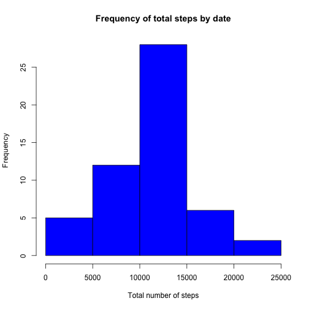

## Loading and preprocessing the data

First we load the required libraries for our analysis.


```r
library(knitr)
library(ggplot2)
library(grid)
library(dplyr)
```

Make sure the activity file has been downloaded, extracted and placed in a data directory for use.  If not, download and/or unzip activity.zip and place it in the correct directory.


```r
if (!file.exists("data/activity.csv")) {
    if (!dir.exists("data")) {
        dir.create("data")
    }
    if (file.exists("activity.zip")) {
        unzip("activity.zip", exdir = "data")
    }
    else {
        download.file("https://d396qusza40orc.cloudfront.net/repdata%2Fdata%2Factivity.zip",
                      destfile = "activity.zip", method = "curl")
        unzip("activity.zip", exdir = "data")
    }
} 
```

Load the csv file and quickly examine the resulting data frame.


```r
activity <- read.csv("data/activity.csv", stringsAsFactors = FALSE)
activity$date <- as.Date(activity$date, format = "%Y-%m-%d")

str(activity)
```

```
## 'data.frame':	17568 obs. of  3 variables:
##  $ steps   : int  NA NA NA NA NA NA NA NA NA NA ...
##  $ date    : Date, format: "2012-10-01" "2012-10-01" ...
##  $ interval: int  0 5 10 15 20 25 30 35 40 45 ...
```

## What is mean total number of steps taken per day?

To calculate steps by date, remove the NA values from the data set and aggregate by date, calculating the total number of steps for each day.


```r
stepsbydate <- na.omit(activity)
stepsbydate <- aggregate(stepsbydate$steps, by = list(stepsbydate$date), FUN = sum)
names(stepsbydate) <- c("date", "totalsteps")

summary(stepsbydate)
```

```
##       date              totalsteps   
##  Min.   :2012-10-02   Min.   :   41  
##  1st Qu.:2012-10-16   1st Qu.: 8841  
##  Median :2012-10-29   Median :10765  
##  Mean   :2012-10-30   Mean   :10766  
##  3rd Qu.:2012-11-16   3rd Qu.:13294  
##  Max.   :2012-11-29   Max.   :21194
```

Steps by date can be visualized using a histogram to show the distribution of total steps by date.


```r
hist(stepsbydate$totalsteps, xlab = "Total number of steps", ylab = "Frequency", 
     main = "Frequency of total steps by date", col = "blue")
```

 

Calculate the mean and median for the total number of steps by date.


```r
mean(stepsbydate$totalsteps)
```

```
## [1] 10766.19
```


```r
median(stepsbydate$totalsteps)
```

```
## [1] 10765
```

## What is the average daily activity pattern?

To look at the average daily activity, first create a new data frame from our activity table (removing NA values) and summarizing average steps by interval across dates.


```r
stepsbyinterval <- na.omit(activity)
stepsbyinterval <- aggregate(stepsbyinterval$steps, by = list(stepsbyinterval$interval), FUN = mean)
names(stepsbyinterval) <- c("interval", "averagesteps")
```

We can see that the new data frame has 288 observations of our two variables (1 observation corresponding to each fine minute interval in a 24 hour day).


```r
dim(stepsbyinterval)
```

```
## [1] 288   2
```

To visualize activity patterns throughout an average day, we can make a time series plot of the 5-minute intervals and the average number of steps taken. The maximum level of average steps per interval is marked with a dashed line.  (Note: this time our plot is created with the ggplot2 package.)


```r
p <- ggplot(data = stepsbyinterval, aes(x = interval, y = averagesteps)) + 
    coord_cartesian(xlim = c(0, 2400), ylim = c(0, 225)) +  geom_line(color = "blue") +
    geom_hline(yintercept = max(stepsbyinterval$averagesteps), color = "red", alpha = 0.5, 
    linetype = "dashed")
p + labs(title = "Average Steps by Time Interval", x = "Time Interval", y = "Average Steps")
```

 

To determine exactly which time interval has the highest average steps, we can subset our data frame to show that the highest average interval is interval 835, with an average step count of 206.


```r
stepsbyinterval[stepsbyinterval$averagesteps == max(stepsbyinterval$averagesteps), ]
```

```
##     interval averagesteps
## 104      835     206.1698
```

## Imputing missing values

Given that there are a number of days/intervals where there are missing values (potentially introducing bias into some of our calculations and summaries), we should look for ways to minimize that issue.

To identify the scale of the NA issue, we can calculate the total number of missing values in the dataset.


```r
sum(is.na(activity$steps))
```

```
## [1] 2304
```

To fill the missing values in the dataset, we will assume that the day and level of activity is an average day from our measurement period.  The steps for the interval will be updated to be the average for that interval across all days in our measurement period.


```r
filled <- merge(activity, stepsbyinterval, all.x = TRUE, sort = FALSE)
filled <- mutate(filled, steps = ifelse(is.na(steps), round(averagesteps), steps))
filled <- arrange(filled, date, interval)
filled <- select(filled, steps, date, interval)
```

This gives us a dataset identical to the original activity set, but with the missing data filled in with the average steps for that interval across all dates.


```r
head(filled)
```

```
##   steps       date interval
## 1     2 2012-10-01        0
## 2     0 2012-10-01        5
## 3     0 2012-10-01       10
## 4     0 2012-10-01       15
## 5     0 2012-10-01       20
## 6     2 2012-10-01       25
```

Now we can recalculate our steps by date information with the dataset we just created.


```r
filledstepsbydate <- aggregate(filled$steps, by = list(filled$date), FUN = sum)
names(filledstepsbydate) <- c("date", "totalsteps")

summary(filledstepsbydate)
```

```
##       date              totalsteps   
##  Min.   :2012-10-01   Min.   :   41  
##  1st Qu.:2012-10-16   1st Qu.: 9819  
##  Median :2012-10-31   Median :10762  
##  Mean   :2012-10-31   Mean   :10766  
##  3rd Qu.:2012-11-15   3rd Qu.:12811  
##  Max.   :2012-11-30   Max.   :21194
```

We can again look at the distribution of steps by date using a histogram to see if our strategy to fill in the missing data has substantially changed our distribution.


```r
hist(filledstepsbydate$totalsteps, xlab = "Total number of steps", ylab = "Frequency", 
     main = "Frequency of total steps by date", col = "blue")
```

 

Calculate the mean and median for the total number of steps by date.


```r
mean(filledstepsbydate$totalsteps)
```

```
## [1] 10765.64
```


```r
median(filledstepsbydate$totalsteps)
```

```
## [1] 10762
```

By looking at the analysis of our new data and its distribution, we can make several observations:  

*   By imputing the missing data, we increased the frequency of days in the 10,000 to 15,000 step range  
*   Our method of imputing the missing data created a histogram with a visually similar distribution  
*   The mean and median of the new dataset differed only very slightly from our original dataset with NAs removed.  The mean decreased by 0.0051% and the median decreased by 0.028%.

## Are there differences in activity patterns between weekdays and weekends?

Using the method of imputing missing data that we examined above, we can split our data into weekdays and weekends by examining the date.  The following code creates a new factor variable which marks each row as being part of a weekday or weekend.


```r
filled <- mutate(filled, day = weekdays(date)) %>% 
    mutate(day = ifelse(day %in% c("Saturday", "Sunday"), "Weekend", "Weekday")) %>%
    mutate(day = as.factor(day))

head(filled)
```

```
##   steps       date interval     day
## 1     2 2012-10-01        0 Weekday
## 2     0 2012-10-01        5 Weekday
## 3     0 2012-10-01       10 Weekday
## 4     0 2012-10-01       15 Weekday
## 5     0 2012-10-01       20 Weekday
## 6     2 2012-10-01       25 Weekday
```

Then, similar to looking at the average steps by interval earlier, we can create a data frame which contains average steps by interval grouped by weekday or weekend.


```r
filledstepsbyinterval <- aggregate(filled$steps, by = list(filled$day, filled$interval), FUN = mean)
names(filledstepsbyinterval) <- c("day", "interval", "averagesteps")
filledstepsbyinterval <- arrange(filledstepsbyinterval, day, interval)
filledstepsbyinterval <- mutate(filledstepsbyinterval, averagesteps = round(averagesteps))

summary(filledstepsbyinterval)
```

```
##       day         interval       averagesteps   
##  Weekday:288   Min.   :   0.0   Min.   :  0.00  
##  Weekend:288   1st Qu.: 588.8   1st Qu.:  2.00  
##                Median :1177.5   Median : 28.00  
##                Mean   :1177.5   Mean   : 38.98  
##                3rd Qu.:1766.2   3rd Qu.: 61.00  
##                Max.   :2355.0   Max.   :230.00
```

Finally we can plot the data by Weekday vs Weekend to see if there is a different pattern to the activity.


```r
p <- ggplot(data = filledstepsbyinterval, aes(x = interval, y = averagesteps)) + geom_line(color = "blue") 
p + facet_wrap(~day, ncol=1) + labs(title = "Average Steps by Interval - Weekday vs Weekend", 
    x = "Time Interval", y = "Average Steps")
```

 

We can see from our analysis that weekend activity starts later on average than weekday activity and does not show the high spike that weekday activity shows, but that weekend activity shows more spikes of greater than 100 steps per time interval throughout the day.
